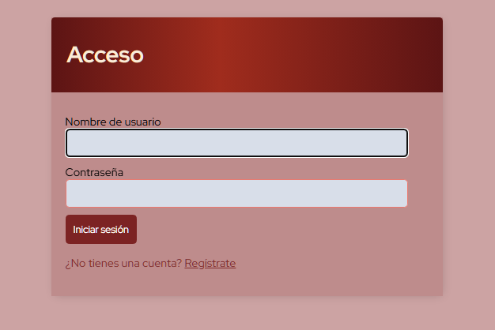
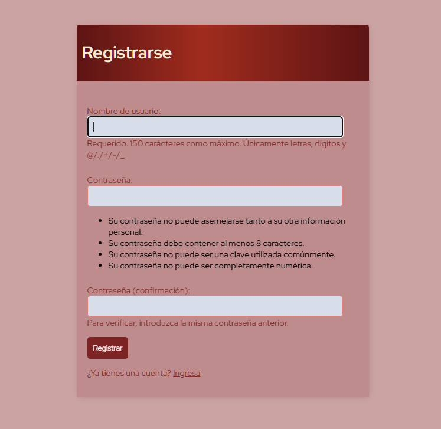
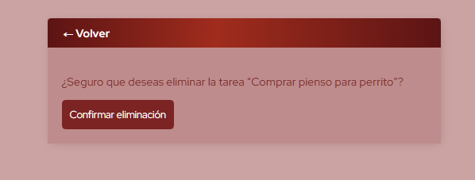

# Lista-de-Tareas

Aplicación de ejemplo para gestionar tareas. Proyecto preparado para demostración y pruebas, con CI mínimo configurado.

[](https://github.com/Yisus95/Lista-de-Tareas/actions/workflows/ci.yml)  

Estado
- CI: ✅ (workflow `ci-minimal.yml` ejecuta tests)
- Presentable: ✅ (limpieza básica y .gitignore aplicado)

## Capturas

<p align="center">
<br>
<em>Acceso o registro de nuevo usuario.</em>
</p>

<p align="center">
<br>
<em>Registro de nuevos usuarios.</em>
</p>

<p align="center">
<br>
<em>Lista con buscador, creación rápida y estados de tarea.</em>
</p>

<p align="center">
<br>
<em>Crear nueva tarea.</em>
</p>

<p align="center">
<br>
<em>Confirmación y mensaje flash al borrar tarea.</em>
</p>

## Características
- CRUD de tareas (crear, listar, editar, borrar).
- Búsqueda por título.
- Marcar como completada.
- Confirmación de eliminación y mensajes flash al borrar.
- Mensajes flash estilizados y auto-ocultado (CSS + JS).
- Protección: las vistas CRUD filtran por usuario (no puedes tocar tareas ajenas).

## Instalación (local)
1. Clonar
```bash
git clone https://github.com/Yisus95/Lista-de-Tareas.git
cd Lista-de-Tareas
```

2. Crear entorno virtual e instalar dependencias
```bash
python -m venv .venv
.\.venv\Scripts\Activate    # Windows
# source .venv/bin/activate # macOS / Linux
pip install -r requirements.txt
```

3. Migraciones (si aplican, p. ej. Django)
```bash
python manage.py migrate
python manage.py runserver
```

Accede a: http://127.0.0.1:8000

## Tests
Ejecutar tests locales:
```bash
pytest -q
```

## CI
GitHub Actions ejecuta `ci-minimal.yml` en cada push/PR y corre los tests. El workflow está en `.github/workflows/ci-minimal.yml`.

## Estructura del repo
- `src/proyecto/` — código fuente principal  
- `docs/screenshots/` — capturas usadas en este README  
- `.github/workflows/ci-minimal.yml` — workflow CI  
- `.gitignore` — archivos ignorados (venv, tmpenv, node_modules, db)

## Qué he limpiado / recomendaciones
- Ignorar y eliminar del índice carpetas de entornos y DB locales (añadir `.gitignore` si falta).  
- Mantener `main` estable; usar ramas por funcionalidad y PRs con `Squash and merge` para un historial limpio.  
- Si hay archivos grandes en el historial y quieres reducir el tamaño del repo, usar BFG/git-filter-repo (te puedo ayudar si lo deseas).

## Licencia
- MIT (añade un `LICENSE` si quieres publicar con licencia).

## Contacto
- Autor: Yisus95 — https://github.com/Yisus95
```
