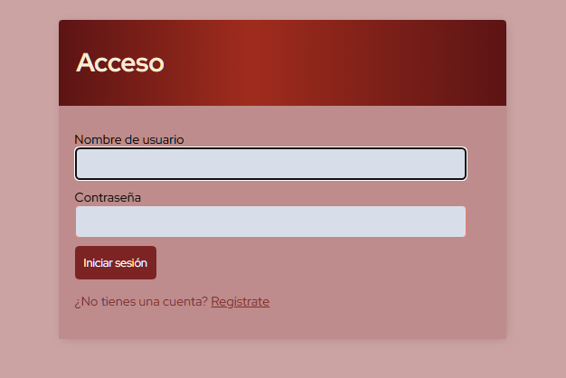
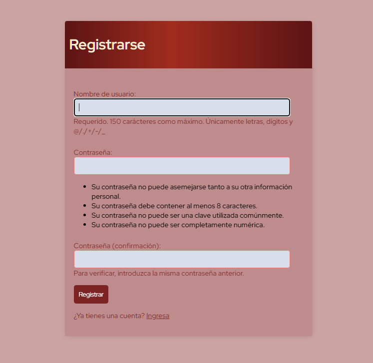
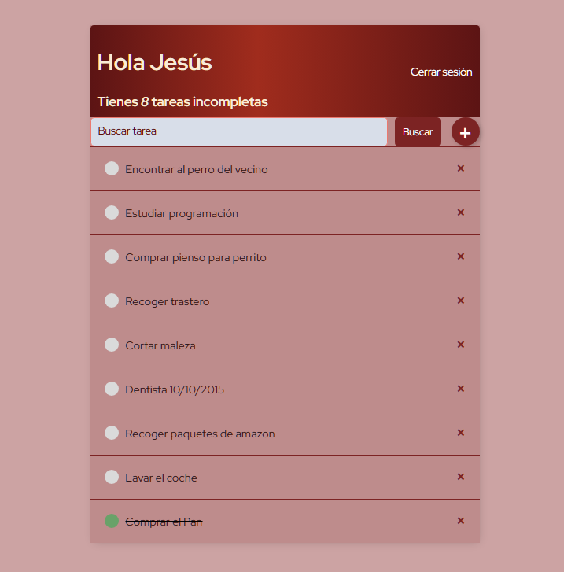
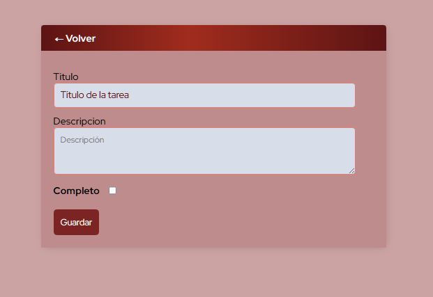
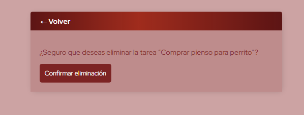

# Lista-de-Tareas

Aplicación de ejemplo para gestionar tareas. Proyecto preparado para demostración y pruebas, con un CI mínimo configurado para ejecutar los tests automáticamente.

[](https://github.com/Yisus95/Lista-de-Tareas/actions/workflows/test.yml)  

---

## Estado
- CI: ✅ (workflow `ci-minimal.yml` ejecuta tests)
- Presentable: ✅ (limpieza básica y `.gitignore` aplicado)

---

## Capturas

<p align="center">
<br>
<em>Acceso o registro de nuevo usuario.</em>
</p>

<p align="center">
<br>
<em>Registro de nuevos usuarios.</em>
</p>

<p align="center">
<br>
<em>Lista con buscador, creación rápida y estados de tarea.</em>
</p>

<p align="center">
<br>
<em>Crear nueva tarea.</em>
</p>

<p align="center">
<br>
<em>Confirmación y mensaje flash al borrar tarea.</em>
</p>

---

## Características
- CRUD completo de tareas (crear, listar, editar, borrar).  
- Búsqueda por título.  
- Marcar tareas como completadas.  
- Confirmación de eliminación y mensajes flash (con estilo y auto-ocultado).  
- Vistas protegidas: cada usuario solo ve/gestiona sus propias tareas.

---

## Requisitos
- Python 3.8+  
- Virtual environment recomendado  
- Dependencias en `requirements.txt` (instalarlas con pip)

---

## Instalación (local)

1. Clonar el repositorio
```bash
git clone https://github.com/Yisus95/Lista-de-Tareas.git
cd Lista-de-Tareas
```

2. Crear y activar entorno virtual
```bash
python -m venv .venv
# Windows
.\.venv\Scripts\Activate
# macOS / Linux
# source .venv/bin/activate
```

3. Instalar dependencias
```bash
pip install -r requirements.txt
```

4. Migraciones y ejecución (si aplica, p. ej. Django)
```bash
python manage.py migrate
python manage.py runserver
```

Abrir: http://127.0.0.1:8000

---

## Tests

Ejecutar tests locales:
```bash
pytest -q
```

Si el CI falla por formateo, en local puedes verificar:
```bash
black --check .
isort --check-only .
```

---

## CI

GitHub Actions ejecuta `ci-minimal.yml` en cada push/PR y corre los tests. El workflow está en `.github/workflows/ci-minimal.yml`. El badge arriba enlaza a la página del workflow.

---

## Estructura del repo (resumen)
- `src/proyecto/` — código fuente principal  
- `docs/screenshots/` — capturas usadas en este README  
- `.github/workflows/ci-minimal.yml` — workflow CI  
- `.gitignore` — ficheros/dirs ignorados (venv, tmpenv, node_modules, db, etc.)

---

## Buenas prácticas / notas para presentación
- Mantén `main` estable; trabaja en ramas por funcionalidad (`feature/x`, `fix/x`, `presentable`).  
- Para presentar, usar PR + `Squash and merge` deja el historial limpio en `main`.  
- No comitees entornos virtuales ni bases de datos locales. Añade estos patrones a `.gitignore` si faltan.

---

## Solución de problemas rápida
- Si falta una dependencia: `pip install -r requirements.txt`.  
- Si tests fallan por rutas o imports tras mover ficheros: revisa `PYTHONPATH` o estructura de paquetes (añade `__init__.py` si es necesario).  
- Si black/isort intentan formatear carpetas del entorno, añade las rutas a `.gitignore` y limita los paths en el workflow.

---

## Contribuir
1. Haz fork y crea una rama con el prefijo `feature/` o `fix/`.  
2. Abre PR con descripción y checklist.  
3. Usa `Squash and merge` si quieres un único commit en `main`.

---

## Licencia
MIT — añade un fichero `LICENSE` con el texto si quieres publicar con licencia.

---

## Contacto
- Autor: Yisus95 — https://github.com/Yisus95
